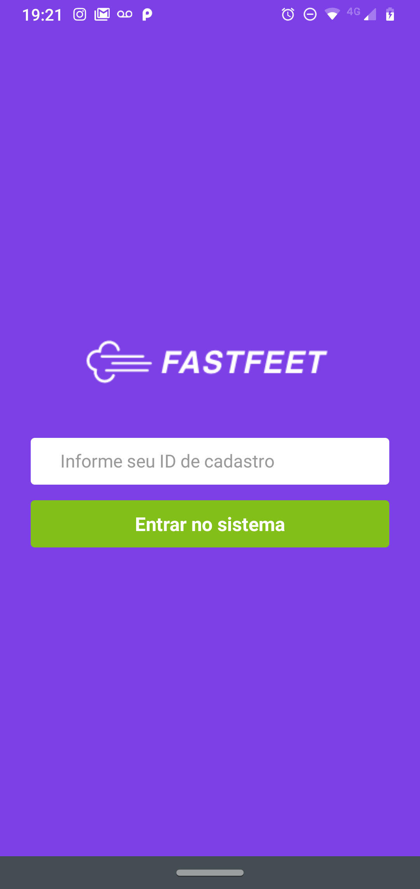
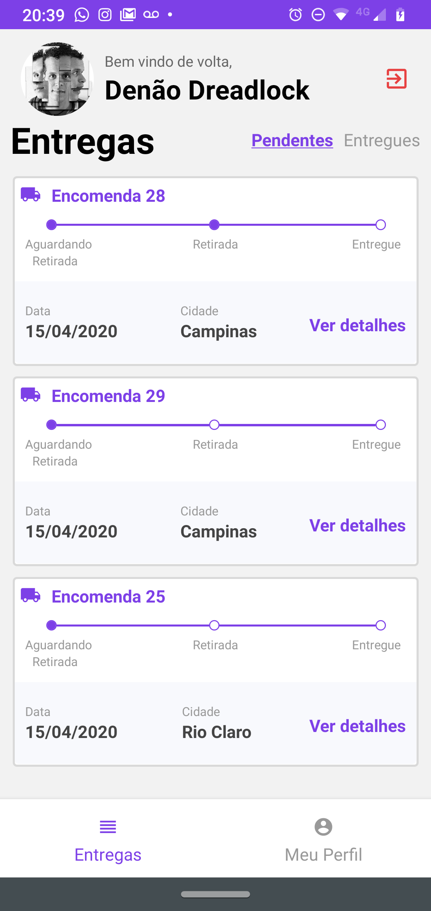
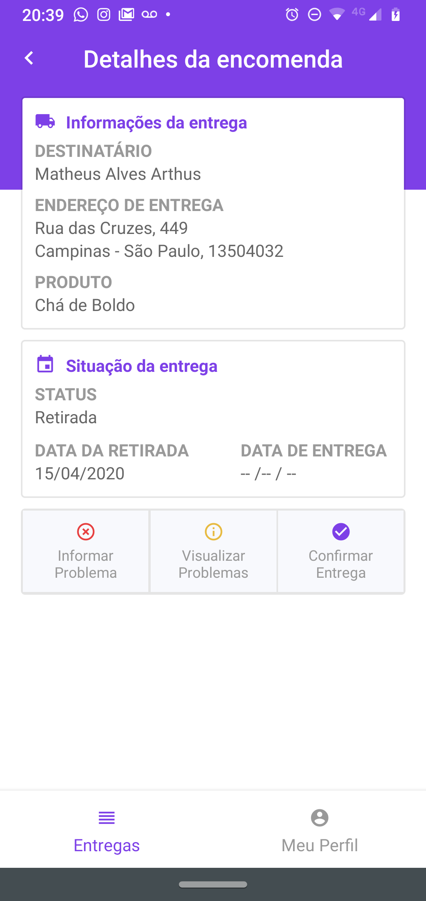
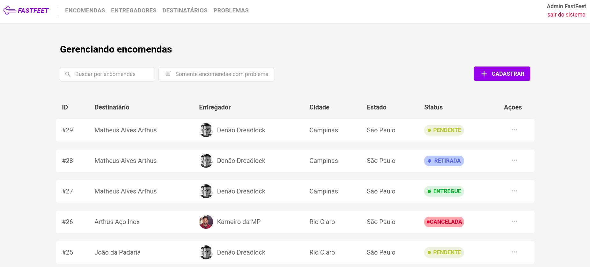

<h1 align="center">
  
</h1>

<h3 align="center">
  Desafio final: FastFeet 
</h3>

Esse projeto é o Desafio Final para emissão do Certificado do Bootcamp GoStack, que se constitui de uma aplicação completa (Back-end, Front-end e Mobile) de gerenciamento logístico de uma transportadora fictícia chamada FastFeet.

## Sobre o desafio

**FastFeet** é uma aplicação de logística, feito com o intuíto de auxiliar no gerenciamento e no controle das entregas de encomendas.

Esse auxílio é feito através de ferramentas que permitem, ao administrador, o cadastro de entregadores, destinatários e encomendas; a associação destas encomendas aos entregadores que, por sua vez, administram suas entregas através do aplicativo mobile; e o gerenciamento dos problemas ocorridos nas entregas possibilitando, eventualmente, o cancelamento das mesmas.

No aplicativo mobile, o entregador tem acesso às encomendas atribudas a ele (pendentes e já concluídas); tem os recursos de confirmação de retirada de encomenda e de entrega conclúida (atestada por uma foto da assinatura do destinatário); e, também, a possibilidade de cadastrar um problema com uma entrega especfica e visualizar o histórico de problemas atribuídos.

As tecnologias utilizadas no desenvolvimento, foram: **Node.js**, **ReactJS** e **React Native**.

  
  
  

  

## Back-end

Para executar o back-end é preciso acessar, via terminal, a pasta `backend` e seguir os seguintes passos:

**1.** Criar containers de Postgres e Redis no Docker, com o comando:

`docker run --name db_fastfeet -e POSTGRES_PASSWORD=docker -p 5433:5432 -d postgres`

e

`docker run --name redisfastfeet -p 6380:6379 -d -t redis:alpine`

**2.** Iniciar bancos de dados no Docker, com o comando: 

`docker start db_fastfeet redisfastfeet`

**3.** Gerar as tabelas no banco de dados, através das migrations e seeds do Sequelize, com os comandos:

`yarn sequelize db:migrate` e `yarn sequelize db:seed:all`

**4.** Configurar o MailTrap no arquivo `web/src/config/mail.js` com o `user` e `pass` da sua conta.

**5.** Finalmente, executar o comando `yarn dev` para rodar a api.

## Web

Para executar a aplicação web você deve acessar, via terminal, a pasta `web` e executar: `yarn start`.

## Mobile (somente Android)

Para executar a aplicação Mobile você deve acessar, via terminal, a pasta `mobile` e seguir os seguintes passos:

**1.** Configurar o arquivo `mobile/src/services/api.js` com ip correto (vide observações abaixo) para que a aplicação consiga acessar a api.

**Obs1:** Se você for rodar a aplicação no AndroidStudio, o ip deve ser `'10.0.0.2'`; se for no geneMotion, `'10.0.3.2'`; e se for com o aparelho físico via usb, deve ser o ip da sua máquina.

**Obs2:** Se a aplicação não estiver conseguindo acessar a api, faça o remapeamento de porta com o comando: `adb reverse tcp:3334 tcp:3334`.

**2.** Agora rode o Metro Bundler com o comando `yarn start`.

**3.** Em outra aba do terminal, instale a aplicação com o comando `react-native run-android`.

