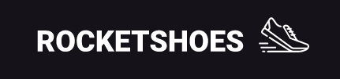

<h1 align="center">
  
</h1>

<h3 align="center">
  Front-end web: Rocketshoes
</h3>

Esse projeto é referente ao módulo 07 da 10ª edição do Bootcamp GoStack da Rocketseat. 

## Sobre o módulo

**RocketShoes** é uma aplicação web de e-commerce referente à uma loja fictícia de venda de tênis. 

O e-commerce se constítui de duas páginas: uma principal, a vitrine com os produtos; e o carrinho, onde ficam listados os items, as quantidades dos produtos e os valores referentes aos produtos que o usuário selecionou para compra.

A aplicação foi criada com **ReactJS** seguindo a arquitetura **Flux** por meio das libs **Redux** e **Redux Saga**. 

  
Página principal:

  
  
Página do carrinho:

  

## Back-end

O back-end foi simulado através de uma fake REST API com **json-server**.  

Para executar a API é preciso instalar o **json-server** globalmente com o comando: 

`yarn global add json-server`

E depois, para rodar o servidor, você deve acessar a pasta raiz do projeto via terminal e executar o comando: 

`json-server server.json -p 3333`

## Web

Para executar a aplicação web você deve acessar, via terminal, a pasta raiz do projeto e executar: `yarn start`.

